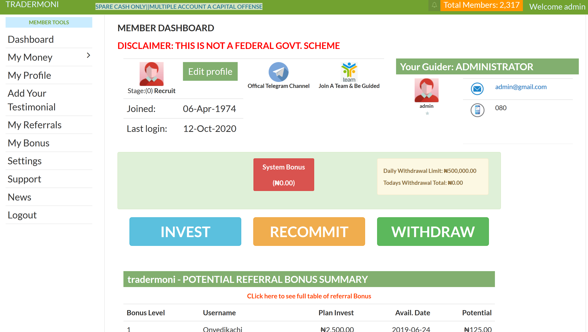
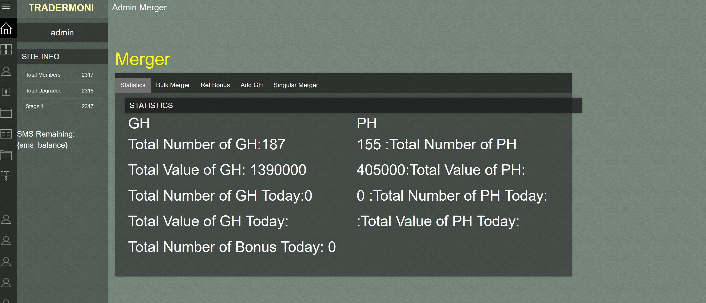

#Update 2024
*We will develop any script for you free of charge on a partnership as agreed. If Interested, send me a DM @uchimadarasan on Telegram or send an email to uchimadarasan@gmail.com

#Update 2023
* Get Secured and Updated Clone Scripts. Investment, hyip,trading and ponzi scripts etc. Scripts like Ammdefi clone scripts, Afriq Arbitrage System(AAS) clone scripts, Coinbot Clone Script etc. in all currencies. We offer Consultation & development services. https://github.com/uchimadara/hyip_ponzi_clone

# PonziStory-2.0
> PonziStory 2.0 is a clone of the Popular Tradermoni p2p script. A typical Get Help and Provide help Script like MMM with top notch functionalities. 
demo: https://tdm.nghelpers.com

# Features
* InvestMent
* Recommitment
* Withdrawals
* Support
* Statistics
* Livechat
* RObust Admin Panel
* Multi Merging System
* Referral Bonus
* System Bonus
* Infact Check the Demo.. Too Much

![]

## Installation

1. Copy this file to your Server (Localhost or cpanel or any)
2. Make sure your PHP version is 5.6
3. Create a database and import the Database File
4. Goto CI->Application->Config->Database.php and edit the database credentials with yours
5. Set The URL name in CI->Application->Config->config.php and in your Settings table in database
6. THen run the url on a browser.

To access Admin Panel
First login with Admin details: Username: admin Password:admina then change the url to /admin eg. www.example.com/admin

Support: You want us to support u with Installation and setup send us a mail @ uchimadarasan@gmail.com

Warning: This is for Educational purpose only and should not be used for illicit purpose.

## Release History

* 1.2.1
    * CHANGE: Update docs (module code remains unchanged)
* 1.2.0
    * CHANGE: Remove `setDefaultXYZ()`
    * ADD: Add `init()`
* 1.1.1
    * FIX: Crash when calling `baz()` (Thanks @GenerousContributorName!)
* 1.1.0
    * The first proper release
    * CHANGE: Rename `foo()` to `bar()`
* 1.0.1
    * Work in progress

## Meta

- Email – uchimadarasan@gmail.com

Distributed under the XYZ license. See ``LICENSE`` for more information.

